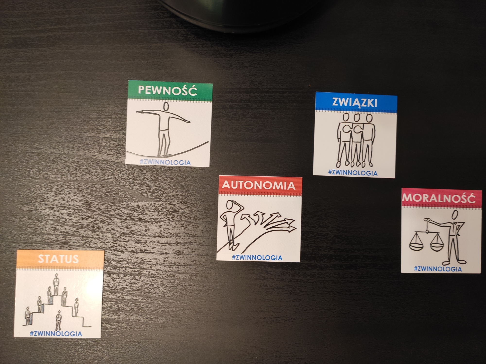

--- 
path: "/60AW"
date: "2020-02-11"
title: "AW #60 'Jak wdrażać przedsięwzięcia bez SPAZM-u?' - Jarosław Rubin"
author: "mfordas"
tags: ["agile", "meetup", "management"]
short: "Zmiany. Każdy kiedyś musi jakąś
                                        przejść. Może być spowodowana decyzją podjętą przez nas samych lub kogoś innego.
                                        Jak przeprowadzać zmiany żeby były nie tylko skuteczne ale i przyjemne? W tym
                                        może pomóc nam Zwinnologia i karty SPAZM."
pic: "change-4056014_1920.jpg"
---

                            
Warsztat prowadził Jarosław Rubin jeden z
                                autorów <a href='http://www.mtbiznes.pl/b2409-zwinnologia.htm'
                                    target='_blank'><b>Zwinnologi</b></a>. Od 15 lat pomagający firmom zmieniać się na
                                lepsze, przy pełnym
                                zaangażowaniu pracowników. Można o nim powiedzieć - specjalista od zmiany.
                            

                            
Które zmiany są dla nas przyjemne? Ano te,
                                które sami chcemy przeprowadzić. Może nie zawsze są łatwe do wprowadzenia ale gdy sami
                                podejmiemy decyzję o zmianie to mamy większą motywację do jej zrealizowania. Gdy zmiana
                                przychodzi z zewnątrz automatycznie włącza nam się lampka bezpieczeństwa - jak wpłynie
                                ona na nasze życie?
                            

                            

                                Jak sobie poradzić z tą sytuacją w miejscu pracy, w którym bądź co bądź dużo zmian
                                jest narzuconych 'z góry'? Tutaj przychodzi nam z pomocą model SPAZM. Jest to polska
                                adaptacja
                                modelu David'a Rock'a, która w angielskiej wersji brzmi SCARF i jest skrótem od:
                                <ul>
                                    <li><b>S</b>tatus</li>
                                    <li><b>C</b>ertainty</li>
                                    <li><b>A</b>utonomy</li>
                                    <li><b>R</b>elatedness</li>
                                    <li><b>F</b>airness.</li>
                                </ul>
                            

                            

                                Na język polski zostało to przetłumaczone przez autorów Zwinnologi jako:
                                <ul>
                                    <li><b>S</b>tatus</li>
                                    <li><b>P</b>ewność</li>
                                    <li><b>A</b>utonomia</li>
                                    <li><b>Z</b>wiązki</li>
                                    <li><b>M</b>oralność</li>
                                </ul>
                                Jarek opowiadał, że przez moralność mieli na myśli uczciwość / sprawiedliwość.
                            

                            

                                No i fajnie, rozwineliśmy sobie skrót SPAZM, co dalej? Jak ma nam to pomóc w zmianie?
                                Tutaj do akcji wkraczają karty SPAZM. Można ich używać w różny sposób i w różnych
                                sytuacjach - w grupie i indywidualnie.
                            

                            

                                Przykładowo - jesteśmy właśnie formującym się zespołem, nie znamy się zbyt dobrze, nie
                                wiemy co jest dla kogo ważne. Przez to często dochodzi do sytuacji konfliktowych.
                                Jednemu zależy na dużej swobodzie i szybkim rozwoju, drugiemu na tym żeby być wysoko w
                                hierarchii firmowej, a trzeciemu na super atmosferze w zespole. Wszystkie te rzeczy da
                                się ze sobą pogodzić, tylko najpierw musimy wiedzieć kto czego potrzebuje. Siadamy więc
                                wszyscy razem, każdy bierze swój zestaw kart SPAZM i układa od najważniejszej do
                                najmniej ważnej dla niego wartości. Później każdy opowiada o tym, co jest dla niego
                                ważne. Proste? Moim zdaniem proste. Możecie powiedzieć, że taką 'sesję' można
                                zrobić bez tych kart - jasne można, ale szczerze sobie odpowiedzcie - kiedy tak na
                                prawdę
                                mieliście czas zastanowić się co jest dla Was ważne w pracy i czy było to łatwe. A te
                                karty to ułatwiają.
                            

                            

                                

                            

                                

                                    Innym zastosowaniem kart SPAZM jest określenie jaki wpływ na nasze wartości będzie
                                    miała wprowadzona zmiana lub zaistnienie jakiejś sytuacji np. pójście na szkolenie,
                                    rozpoczęcie nowego projektu lub kontynuacja jakiegoś starego itd.
                                

                                

                                    Indywidualnie możemy użyć kart do określenia naszych priorytetów w życiu prywatnym.
                                    Do przemyślenia jaką podjąć decyzję w bliższej lub dalszej przyszłości.
                                

                                

                                    Mam nadzieję, że chociaż trochę przybliżyłem Wam model SPAZM i karty SPAZM. Dzięki
                                    za czytanie i jak zwykle zachęcam do kontaktu, i zadawania pytań.
                                

                            
