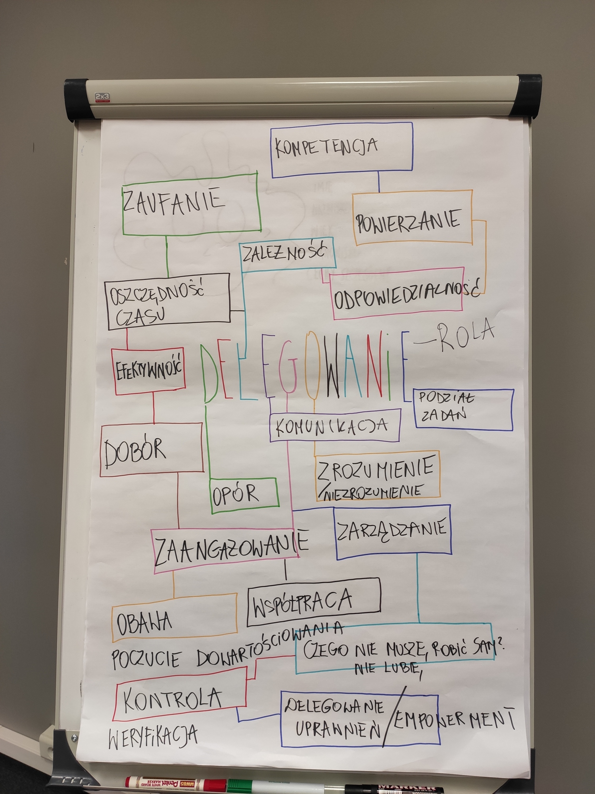
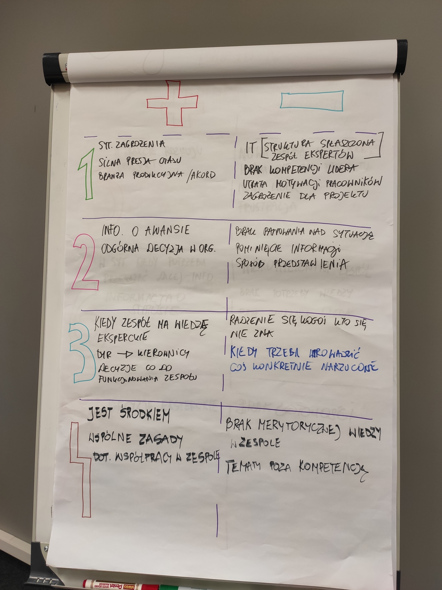
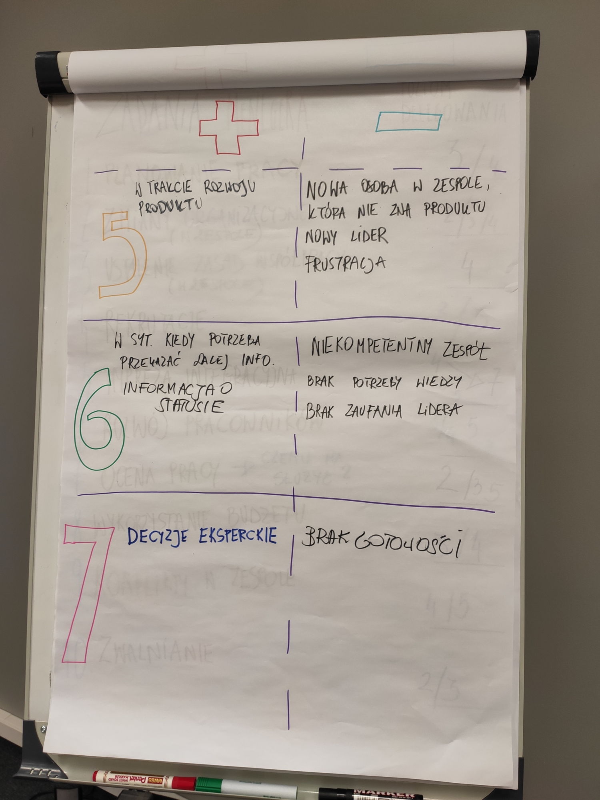
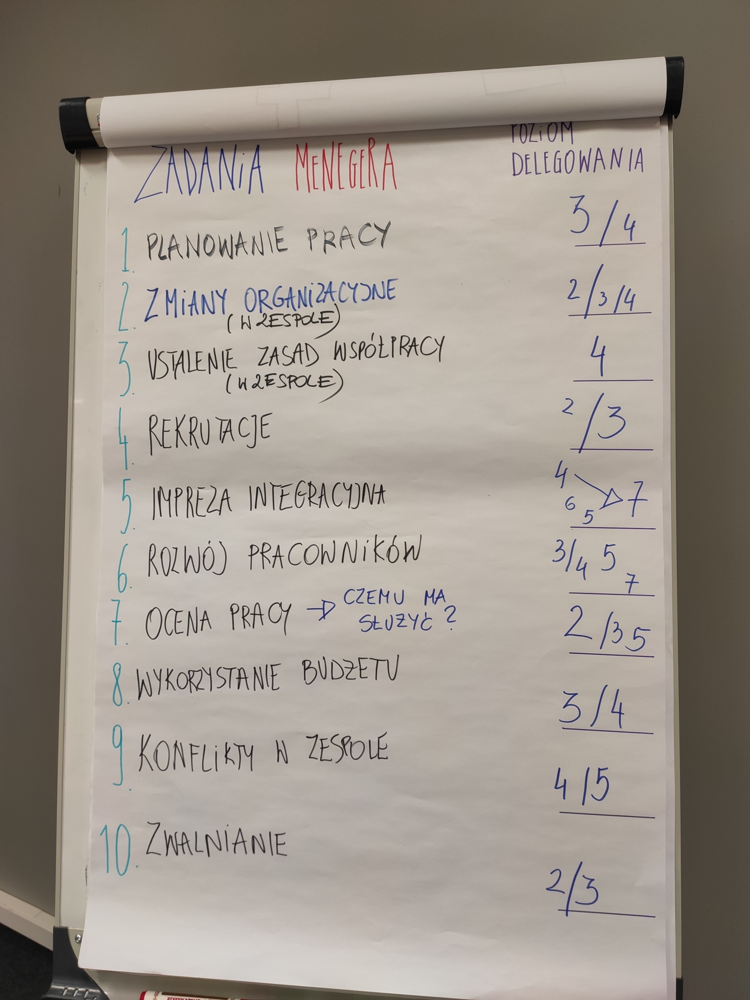

--- 
path: "/T4TDelegowanie"
date: "2020-01-13"
title: "Tools4Teams : #6 Wielopoziomowe delegowanie"
author: "mfordas"
hashtag: "management"
short: "Szósty z kolei meetup Tool4Teams poruszał temat delegowania zadań."
pic: "Del_1.jpg"
---

                            
Ostatnim przed świętami meetup'em z serii
                                Tools4Teams było Wielopoziomowe delegowanie. Macie problemy z powierzaniem zadań swojemu
                                zespołowi? Nawet jeśli to zrobicie to żyjecie w niepewności i stresie czy na pewno
                                wszystko dobrze się skończy? Może z tego wpisu dowiecie się czegoś co pomoże Wam
                                spojrzeć na delegowanie z innej strony i w końcu poczuć się z nim dobrze.
                            

                            
Dla tych, którzy nie widzieli poprzedniego
                                wpisu przedstawię organizatorki tego zamieszania są to: <b>Joanna
                                    Gawinek</b>
                                ze <a href="https://strefa-energii.pl/" target="_blank"><b>Strefy Energii</b></a>
                                oraz <b>Katarzyna Bronowicka</b> z <a href="http://www.freelancingconcept.pl/index.php"
                                    target="_blank"><b>Freelancing Concept</b></a>. Spotkania są zawsze
                                dobrze przygotowane, atmosfera jest super a wiedza, którą można wynieść na pewno przyda
                                się
                                każdemu kto ma do czynienia z pracą w grupie. Meetup'y odbywają się w <a
                                    href="https://25wat.com/pl/" target="_blank"><b>25wat Agencja
                                        Kreatywna</b></a>. Aby być na bieżąco z wydarzeniami polecam śledzić grupę na
                                MeetUpie - <a href="https://www.meetup.com/pl-PL/Tools-4-Teams-management-4-0"
                                    target="_blank"><b>Tools 4 Teams management 4.0</b></a>.
                            

                            

                                Warsztat zaczęliśmy od burzy mózgów podczas, której ustaliliśmy z czym kojarzy nam się
                                delegowanie. Wynik możecie zobaczyć na zdjeciu poniżej.
                            

                            

                                

                            

                                
 Następnie w parach mieliśmy za zadanie wymyślić plusy i minusy poszczególnych
                                    poziomów delegacji. Korzystaliśmy ze skali znanej z Managment'u 3.0:

                                <ol>
                                    <li>Powiedz - sam podejmujesz decyzję i mówisz zespołowi co mają zrobić</li>
                                    <li>Sprzedaj - sam podejmujesz decyzję i próbujesz sprzedać ją zespołowi</li>
                                    <li>Skonsultuj - konsultujesz sytuację a następnie sam podejmujesz decyzję</li>
                                    <li>Uzgodnij - wspólnie decydujecie</li>
                                    <li>Doradź - doradzasz ale zespół decyduje</li>
                                    <li>Zapytaj - zespół sam podejmuje decyzję a dopiero później prosisz o jej
                                        wyjaśnienie</li>
                                    <li>Oddeleguj - zostawiasz inicjatywę zespołowi i nie masz potrzeby wiedzieć nic o
                                        szczegółach</li>
                                </ol>
                            

                            

                                Są to poziomy opracowane przez Jurgena Appelo, na ich temat możecie poczytać na <a
                                    href="https://management30.com/empower-teams/delegation-empowerment/"
                                    target="_blank"><b>tej
                                        stronie</b></a>. Znajdziecie tam również inne tematy związane z Management'em
                                3.0.
                            

                            

                                Na poniższych zdjęciach możecie zobaczyć do jakich wniosków doszliśmy.
                            

                            

                                
                                

                            

                                Kolejnym etapem było przeanalizowanie konkretnych zadań i ocenienie jaki poziom
                                delegacji byśmy w ich przypadku zastosowali.
                            

                            

                                

                            

                                W niektórych przypadkach odpowiedzi znacznie różniły się od siebie, ponieważ różnie
                                podeszliśmy do zadań. Przykładowo przy "Ocenie pracy" rozstrzał był dość duży ale
                                wynikło to z braku określenia celu tej oceny. W pozostałych przypadkach wybór poziomu
                                delegowania pokrywał się w przypadku całej grupy lub różnica była nieznaczna.
                            

                            

                                Podsumowując, po raz kolejny pod okiem Asi i Kasi udało nam się przerobić temat ważny
                                dla każdego lidera jakim jest delegowanie zadań. Dla mnie w delegowaniu najważniejsze
                                jest zaufanie a osiągnięcie poziomu 7 to po prostu droga, którą każdy lider musi przejść
                                ze swoim zespołem.
                            

                            

                                Polecam meetup'y u dziewczyn, kolejny już 29.01.2020 - możecie się na niego zapisać <a href="https://www.meetup.com/pl-PL/Tools-4-Teams-management-4-0/events/267712369/"
                                target="_blank"><b>tutaj</b></a>.
                            

                        
