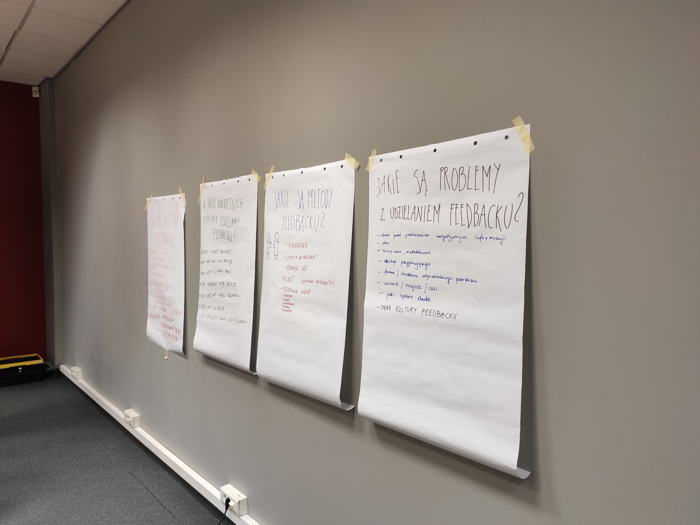
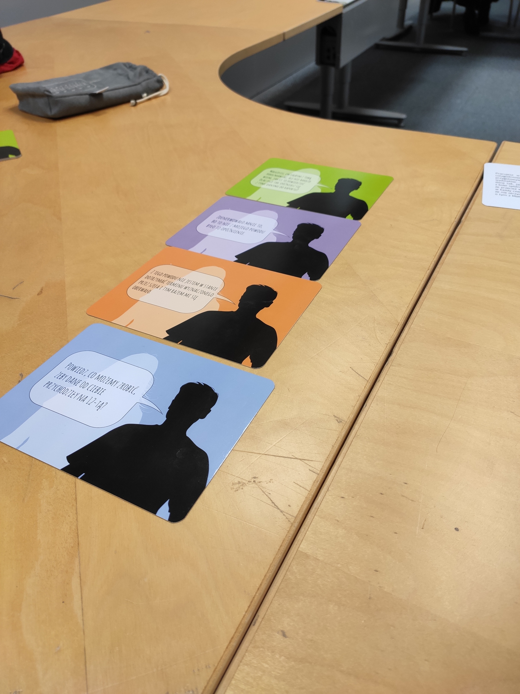

--- 
path: "/T4Tfeedback"
date: "2019-11-28"
title: "Tools4Teams : #5 Konstruktywny feedback"
author: "mfordas"
tags: ["management", "t4t"]
short: "To już piąty meetup z serii
                                        Tools4Teams, tym razem tematem był feedback."
pic: "feedback.jpg"
---

                            
Dwa tygodnie temu obył się piąty już
                                meetup Tools4Teams. Brałem udział w czterech z nich. Pierwszy blok składający się z
                                czterech spotkań był na temat metody FRIS®. Na każdym z nich poznawaliśmy jeden ze styli
                                myślenia. Teraz przyszedł czas na poruszenie tematu feedback'u.
                            

                            
Prowadzącymi spotkania są <b>Joanna
                                    Gawinek</b>
                                ze <a href="https://strefa-energii.pl/" target="_blank"><b>Strefy Energii</b></a>
                                oraz <b>Katarzyna Bronowicka</b> z <a href="http://www.freelancingconcept.pl/index.php"
                                    target="_blank"><b>Freelancing Concept</b></a>. Spotkania są zawsze
                                dobrze przygotowane, atmosfera jest super a wiedza, którą można wynieść na pewno przyda się
                                każdemu kto ma do czynienia z pracą w grupie. Meetup'y odbywają się w <a
                                    href="https://25wat.com/pl/" target="_blank"><b>25wat Agencja
                                    Kreatywna</b></a>. Aby być na bieżąco z wydarzeniami polecam śledzić grupę na
                                MeetUpie - <a href="https://www.meetup.com/pl-PL/Tools-4-Teams-management-4-0"
                                    target="_blank"><b>Tools 4 Teams management 4.0</b></a>.
                            

                            

                                
 Spotkanie o feedbacku było podzielone na dwie części. W pierwszej podzieliliśmy się
                                    na grupy i odpowiedzieliśmy na cztery pytania:

                                <ul>
                                    <li>Co to jest feedback?</li>
                                    <li>W jakich konkretnych sytuacjach udzielamy feedbacku?</li>
                                    <li>Jakie są metody feedbacku?</li>
                                    <li>Jakie są problemy z udzielaniem feedbacku?</li>
                                </ul>
                            

                            

                                

                            

                                Następnie był czas na dyskusję i uzupełnienie odpowiedzi grupowych przez innych
                                uczestników, dzięki czemu powstał całkiem niezły zestaw odpowiedzi będący dobrym
                                początkiem dalszych rozmów.
                            

                            

                                
 W drugiej części wzięliśmy udział w grze Superfeedback na temat udzielania
                                    informacji zwrotnej metodą DEEP. Składa się ona z 4 kroków:

                                <ul>
                                    <li>Opisz działanie, na które chcesz udzielić informacji zwrotnej. Nie zaczynaj od
                                        'Dlaczego?'</li>
                                    <li>Opisz efekt tego działania</li>
                                    <li>Powiedz jakie są twojego emocje</li>
                                    <li>Spróbuj znaleźć rozwiązanie na przyszłość, koniecznie angażując w to osobę,
                                        której udzielasz informacji zwrotnej</li>
                                </ul>
                            

                            

                                

                            

                                Ze spotkania udało mi się wynieść bardzo dużo potrzebnej wiedzy, którą mogę zastosować
                                nie tylko w pracy ale także w życiu prywatnym. Jeśli będziecie mieli czas to polecam wam
                                wybrać się do Joanny i Katarzyny na meetup.
                            

                        
