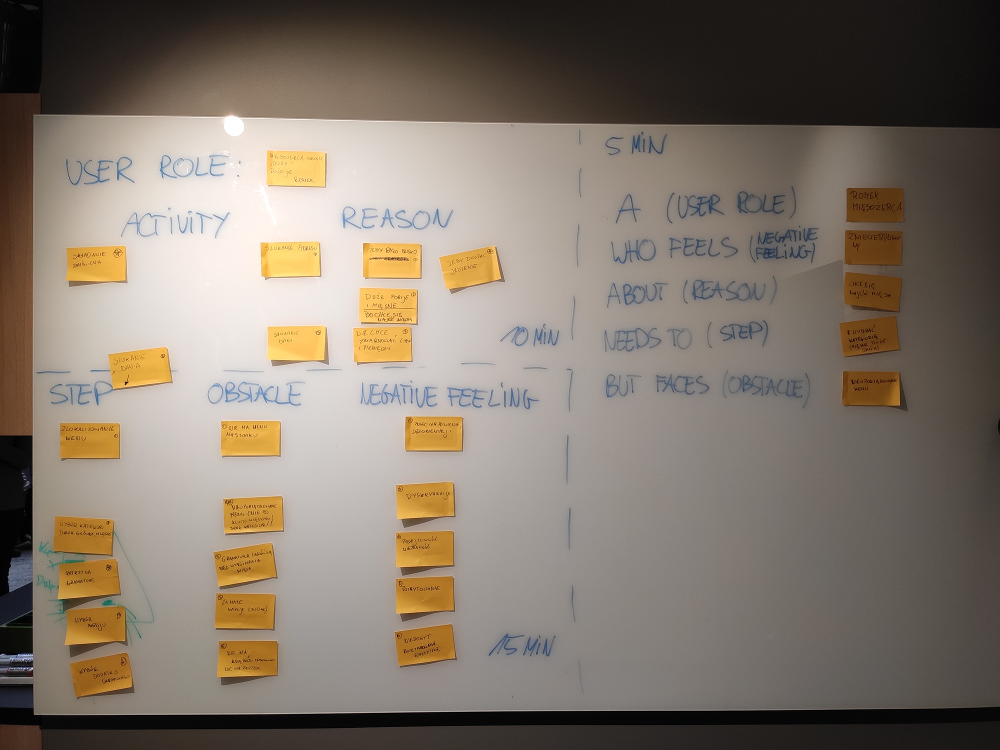

--- 
path: "/UXBurner"
date: "2019-12-05"
title: "Agile on Site #5 - VSF Experts - UX Burner"
author: "mfordas"
tags: ["agile", "scrum"]
short: "Miałem okazję wziąć udział w
        pierwszym w Polsce warsztacie z frameworka UX Burner ogranizowanym przez jego
        twórcę."
pic: "ux-burner.jpg"
---

                            
W zeszłym tygodniu wziąłem udział w
                                warsztacie na temat frameworka UX Burner, który zorganizował jego twórca Gowtham
                                Nedunchezhian oraz Jakub Pluta i Fabian Kreische, którzy pomagali przy jego rozwoju.
                                Wydarzenie odbyło się we wrocławskiej siedzibie firmy <a
                                    href="https://www.vsf-experts.de/EN/" taget="_blank"><b>VSF Experts</b></a>, w
                                której pracują
                                organizatorzy.
                            

                            

                                UX Burner pomaga wkomponować aktywności związane z projektowaniem produktów pod względem
                                doświadczeń użytkownika do Scruma. Można go zastosować zarówno gdy tworzymy nowy produkt
                                jak i wtedy gdy chcemy ulepszyć już istniejący.
                            

                            

                                Warsztat był podzielony na trzy części. Najpierw poznaliśmy historię powstania UX
                                Burnera wraz z jego podstawami teoretycznymi. Następnie zastosowaliśmy to narzędzie w
                                praktyce. Obiektem badań była restauracja a właściwie osoby, które mogą w niej
                                przebywać. Podzieliliśmy się na grupy i wybraliśmy osobę - Romana Mięsożerce. Użyliśmy
                                UXB do zidentyfikowania jego zmartwień. Na zdjęciu poniżej możecie zobaczyć do jakich
                                wniosków doszliśmy.
                            

                            

                                    

                            

                                Narzędzie wydaje się przydatne i warte zastosowania. W zależności od projektu /
                                organizacji / okoliczności pewnie będą potrzebne jakieś modyfikacje ale moim zdaniem
                                warto spróbować. Wszystkie materiały udostępnione są przez Gowtham'a <a
                                href="https://medium.com/ux-burner" taget="_blank"><b>tutaj</b></a>.
                            

                        
