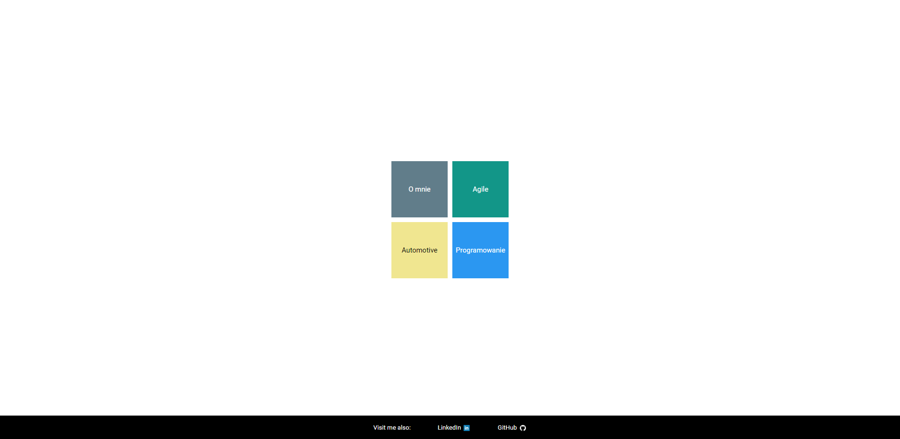
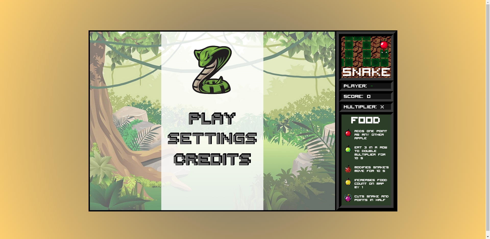
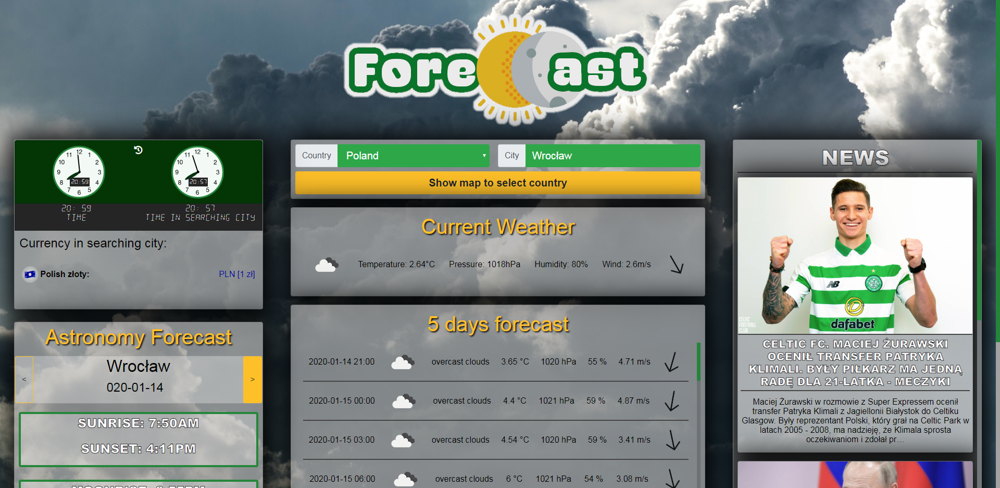
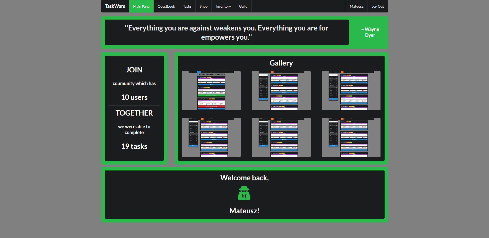
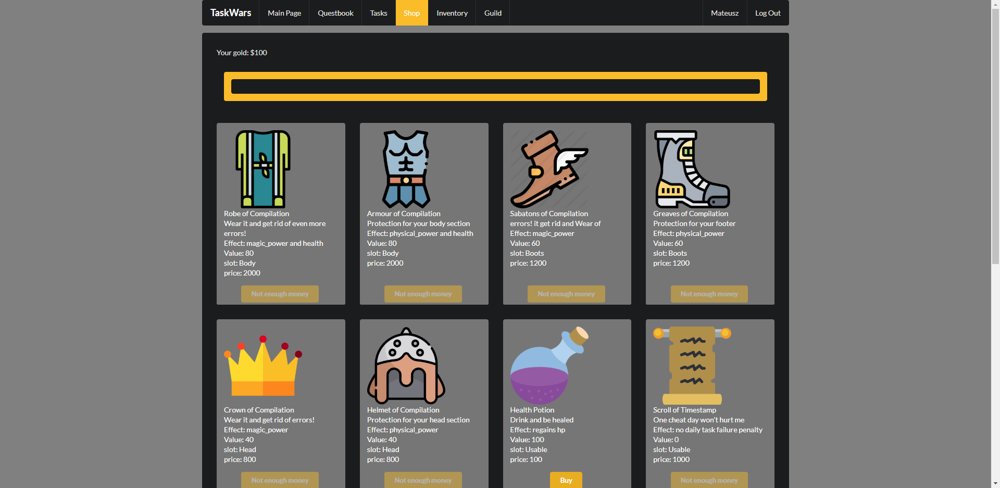
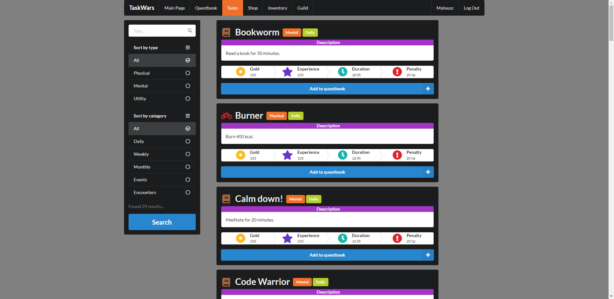
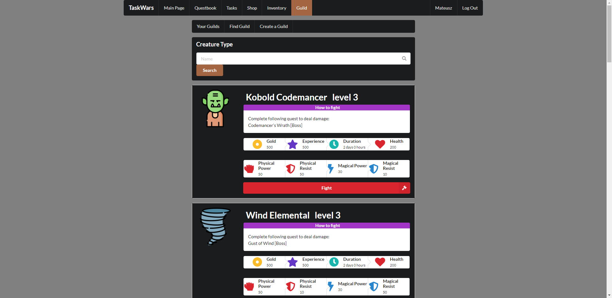

--- 
path: "/coderscampres"
date: "2020-01-14"
title: "CodersCamp - podsumowanie"
author: "mfordas"
tags: ["coding", "webdev", "javascript"]
short: "Trzy miesiące bardzo intensywnej
                                        nauki za mną, czas na podsumowanie kursu."
pic: "group-of-lacrosse-players-celebrating-with-coach-during-159728.jpg"
---

  

                           
To były na prawdę trzy bardzo intensywne miesiące. Praca + nauka do testów +
                                    realizacja projektów + meetup'y skutecznie wypełniały mi kalendarz. Teraz po
                                    zakończeniu CodersCamp czuję trochę pustkę ale równocześnie jestem z siebie
                                    zadowolony, że dałem radę, skończyłem kurs z wyróżnieniem i otrzymałem certyfikat.
                                

                                

                                    

                                
Cały kurs był dla mnie niemałym wyzwaniem ponieważ przed nim miałem raczej mało
                                    doczynienia z programowaniem - w sumie tylko te trzy małe programy napisane w Javie,
                                    które opisałem na tej stronie. Trafiła mi się grupa w której były praktycznie same
                                    osoby studiujące informatykę więc poprzeczka jak dla mnie postawiona była dość
                                    wysoko. 

                                

                                    Kurs był podzielony na pięć części:
                                    <ol>
                                        <li>HTML i CSS</li>
                                        <li>Wprowadzenie do JavaScript</li>
                                        <li>JavaScript na frontendzie</li>
                                        <li>JavaScript na backendzie</li>
                                        <li>React i Redux</li>
                                    </ol>
                                

                                
 Dokładny opis programu możecie znaleźć <a href="https://coderscamp.edu.pl/"
                                        target="_blank"><b>tutaj</b></a>.

                                
Przed każdym z działów musieliśmy przerobić część teoretyczną na którą składały się
                                    artykuły, filmy, kursy z codeacademy i zadania z codewars. Przed każdym projektem
                                    trzeba było zaliczyć na conajmniej 40% test sprawdzający wiedzę teoretyczną.

                                

                                    Do zrealizowania były 4 projekty:
                                    <ol>
                                        <li>Wizytówka - strona internetowa sprawdzająca znajomość HTML i CSS</li>
                                        <li>Interaktywna strona / aplikacja - np. gra</li>
                                        <li>Aplikacja wykorzystująca zewnętrzne API</li>
                                        <li>Aplikacja webowa z własnym API, bazą danych i frontendem stworzonym za
                                            pomocą Reacta i Reduxa</li>
                                    </ol>
                                

                                
Pierwszy projekt realizowaliśmy samodzielnie a pozostałe w grupach. W moim przypadku wizytówką została strona internetowa,
                                    którą właśnie przeglądasz :)
                                

                                

                                    

                                
Drugim projektem była gra Snake, którą robiliśmy w zespole 4 osobowym. Grę możecie
                                    zobaczyć <a href="https://patryqss.github.io/CC.Snake/"
                                        target="_blank"><b>tutaj</b></a>

                                

                                    

                                
Po pierwszym projekcie niestety odpadły nam z grupy dwie osoby więc kolejny projekt
                                    robiliśmy już wszyscy razem w 6 osób. Była to aplikacja pogodowa, dodatkowo
                                    rozbudowana o wiadomości, fazy księżyca, przelicznik walut i zegarek. Nazwa padła na
                                    ForeCCast, możecie ją zobaczyć pod tym <a
                                        href="https://nefariusek.github.io/ForeCCast/"
                                        target="_blank"><b>linkiem</b></a>.

                                

                                
Jako ostatni projekt wybraliśmy aplikację motywującą do rozwoju. Nazywa się TaskWars.
                                    W aplikacji tworzymy swoją postać, którą rozwijamy poprzez realizowanie zadań w
                                    prawdziwym życiu. Przykładowo chcemy zmotywować się do biegania więc dodajemy
                                    zadanie biegania, gdy w prawdziwym życiu zrealizujemy to zadanie i oznaczymy to w
                                    aplikacji to nasza postać dostanie punkty doświadczenia. Dodatkowo możemy zakładać
                                    gildie żeby się wzajemnie motywować. Możemy założyć gildię ludzi czytających książki
                                    i wybrać potwora do walki. Jego pokonanie będzie zależało od tego czy wszyscy
                                    członkowie gildii wykonają swoje zadania. Ta aplikacja doczeka się rozbudowy, więc
                                    zachęcam do śledzenia zmian. Aplikacja jest dostępna <a
                                        href="https://test-tw-deploy.herokuapp.com/login"
                                        target="_blank"><b>tutaj</b></a>.

                                

                                    

                                        

                                    

                                        

                                    

                                        

                                    

                                        

                                

                                

                                    
CodersCamp pozwala zdobyć solidne podstawy HTML, CSS, JS, Node.js, Reacta i
                                        Reduxa.
                                        Moim zdaniem jest to bardzo dobra opcja na start i spróbowanie czy programowanie
                                        to
                                        coś dla nas. Wiadomo, że szczególnie na początku w naukę trzeba włożyć dużo
                                        własnej
                                        pracy i tylko od motywacji uczestnika zależy ile się nauczy. Myślę, że zamiast
                                        wydawać jakieś horrendalne sumy na bootcampy lepiej wziąć udział w CodersCamp.
                                    

                                    
Oprócz wiedzy typowo technicznej CodersCamp pozwala zdobyć doświadczenie w pracy
                                        w
                                        grupie co moim zdaniem jest równie ważne co umiejętności techniczne. Możemy
                                        przekonać się (przynajmniej po części) jakie problemy czekają na programistów
                                        podczas pracy nad projektem. Jeśli ktoś wcześniej nie pracował w grupie może
                                        także
                                        przekonać się jak wygląda sytuacja w której musi dogadać się 9 osób.

                                    
Z kursu jestem bardzo zadowolony, na pewno będę kontynuował naukę programowania.
                                        Poznałem
                                        też fajnych ludzi z którymi, jeszcze trochę rzeczy napiszemy (mam taką
                                        nadzieję).
                                        Kolejna edycja ma ruszyć w październiku 2020, więc jeśli chodzi Wam po głowie
                                        nauka
                                        programowania webowego to śledźcie <a href="https://coderscamp.edu.pl/"
                                            target="_blank"><b>stronę</b></a>. 

                                    
Jeśli macie jakieś pytania dotyczące kursu to piszcie na maila lub poprzez
                                        formularz
                                        kontaktowy, chętnie na nie odpowiem.

                        
