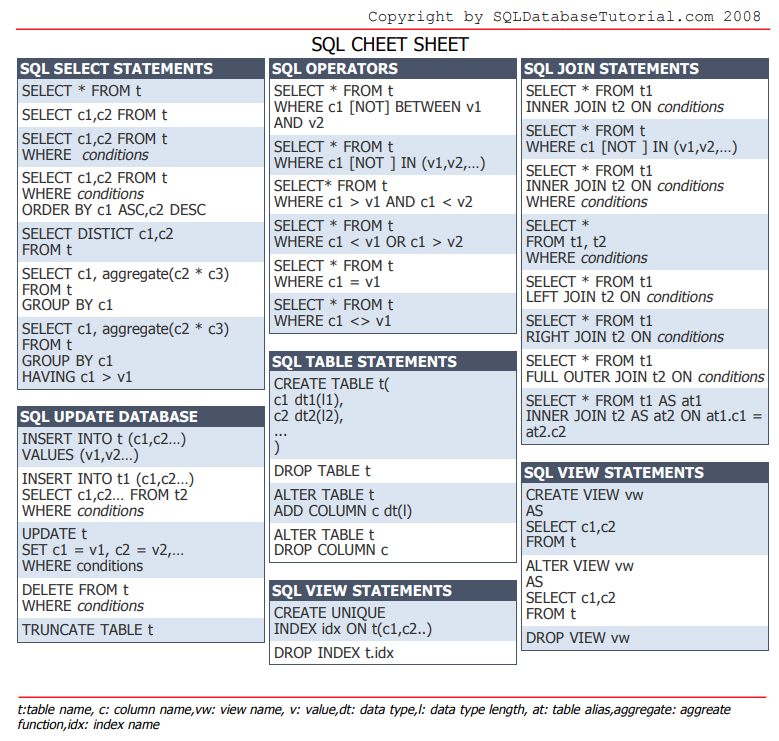

--- 
path: "/db_mysql"
date: "2020-10-19"
title: "Bazy danych - MySQL"
author: "mfordas"
tags: ["databases", "moimislowami", "backend"]
short: "#moimisłowami o MySQL"
pic: "pexels-arif-kemal-köroğlu-5332291.jpg"
---

  

                        
Pojawiła się potrzeba więc pojawił się wpis na temat MySQL :)

                        
Co to jest SQL i MySQL? Definicje z Wikipedii są proste:

                           
<b>SQL (Structured Query Language)</b>– strukturalny język zapytań używany do tworzenia, modyfikowania baz danych oraz do umieszczania i pobierania danych z baz danych.

                           
<a
                                        href="https://dev.mysql.com/"
                                        target="_blank"><b>MySQL</b></a>– wolnodostępny, otwartoźródłowy system zarządzania relacyjnymi bazami danych.

                                 
Podsumowując. MySQL jest to relacyjna baza danych, czyli taka w której dane grupowane są w tabelach. Tabele są zbiorami rekordów (wierszy w tabeli) o określonych atrybutach. Atrybut (pole) jest to część tabeli przechowująca określone dane. Rekordy powiązane są ze sobą za pomocą kluczy podstawowych i obcych. Klucz podstawowy (Primary key) - jedno lub więcej pól, których wartość jednoznacznie identyfikuje każdy rekord w tabeli. Taka cecha klucza nazywana jest unikatowością.

                                  
                                   
Podstawowe rodzaje zapytań w SQL:

                                        

                                    <ol>
                                        <li><b>SELECT</b> - do wyciągania danych z bazy</li>
                                        <li><b>INSERT</b> - do dodawania danych do bazy</li>
                                        <li><b>UPDATE</b> - do aktualizacji danych w bazie</li>
                                        <li><b>DELETE</b> - do usuwania danych z bazy </li>
                                    </ol>
                                

                                
W tym momencie mógłbym tutaj wypisać jakieś przykłady zapytań SQL ale myślę, że na ten temat jest wiele materiałów w Internecie więc wstawiam po prostu dwa cheatsheety z opisanymi zapytaniami:

                                
                                  
                                
Dwie rzeczy, które na pewno warto znać to:
                                    <ol>
                                        <li><b>Grupowanie (GROUP BY)</b></li>
                                        <li><b>Łączenie (JOIN)</b></li>
                                    </ol>
                                

                                
<b>1. Grupowanie</b>

                                

                                Pozwala stworzyć nową kolumnę wirtualną używając przy tym jednej z funkcji agregujących - COUNT(policz ilość rekordów) SUM(zsumuj wartości danego atrybutu), AVG(oblicz średnią z wartości atrybutu), MIN(najmniejsza wartość atrybutu), MAX(największa wartość atrybutu). Nową kolumnę wirtualną tworzymy aby uzyskać jakieś dane statystyczne, np. ile razy wystąpiło jakieś zdarzenie lub jaka była łączna wartość danego atrybutu w czasie.

                                
Wzór zapytania z GROUP BY wygląda tak:

                                

<b>SELECT</b> [nazwa_kolumny_wg_ktorej_chcemy_grupowac] <b>FUNKCJA_AGREGUJĄCA</b>([nazwa_kolumny_z_ktorej_chcemy_czytać_wartości]) <b>AS</b> [nazwa_kolumny_wirtualnej] <b>FROM</b> [nazwy_tabeli_z_których_pobieramy_dane] <b>WHERE</b> [warunki_ktore_musza_być_spełnione_oraz_powiązania] <b>GROUP BY</b> [nazwa_kolumny_wg_ktorej_chcemy_grupować] <b>ORDER BY</b> [nazwa_kolumny_wg_ktorej_chcemy_ustawić_wyniki]

Trochę to długie ale po przeanalizowaniu na przykładzie praktycznym wszystko stało się dla mnie jasne. Polecam oglądnąć <a href="https://www.youtube.com/watch?v=lyE03M2GLA0" target="_blank"><b>odcinek 6</b></a> kursu MySQL z kanału Pasja informatyki w którym autor przedstawia temat grupowania chyba najjaśniej jak się da.
                                

                                
<b>2. Łączenie tabel (JOIN)</b>

                                

                                Umożliwia połączenie dwóch tabel w jedną bazując na określonym warunku.

                                

                                   Mamy trzy główne typy JOIN'a:
                                    <ol>
                                        <li><b>INNER</b> - tworzy tabelę tylko z informacji, które znajdują się w obu tabelach (część wspólna)</li>
                                        <li><b>LEFT OUTER</b> - tworzy tabelę ze wszystkimi wierszami z tabeli lewej nawet jeśli nie istnieją one w tabeli prawej i wierszami mającymi część wspólną w obu tabelach</li>
                                        <li><b>RIGHT OUTER</b> - tworzy tabelę ze wszystkimi wierszami z tabeli prawej nawet jeśli nie istnieją one w tabeli lewej i wierszami mającymi część wspólną w obu tabelach</li>
                                    </ol>
                                

                                
Wzór zapytania z  JOIN wygląda następująco:

                                

<b>SELECT</b> [nazwy_kolumn_które_chcemy_mieć_w_nowej_tabeli] <b>FROM</b> [nazwa_tabeli_lewej] <b>[RODZAJ_JOINA]</b> [nazwa_tabeli_prawej] <b>ON</b> [warunek_wiążący_obie_tabele]

Temat łączenia tabel jest bardzo ładnie wytłumaczony w <a href="https://www.youtube.com/watch?v=9yeOJ0ZMUYw" target="_blank"><b>tym filmie</b></a> na yt.

                                 

                                     Przydatne źródła:
                                    <ul>
                                        <li><a
                                        href="https://www.youtube.com/watch?v=99JAI24Zd24&list=PLOYHgt8dIdoymv-Wzvs8M-OsKFD31VTVZ"
                                        target="_blank"><b>Kurs MySQL - Pasja informatyki</b></a></li>
                                        <li><a
                                        href="https://www.youtube.com/watch?v=t6BQoPoi2UI&list=PL8g9gILZp1OJpjlu7AuR9Ysu4z5Rff_AQ&index=1"
                                        target="_blank"><b>Kurs SQL - nieinformatyk</b></a></li>
                                        <li><a
                                        href="https://dev.mysql.com/doc/"
                                        target="_blank"><b>Dokumentacja MySQL</b></a></li>
                                    </ul>
                                

                        
