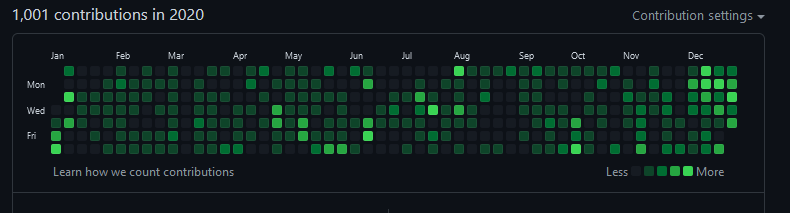
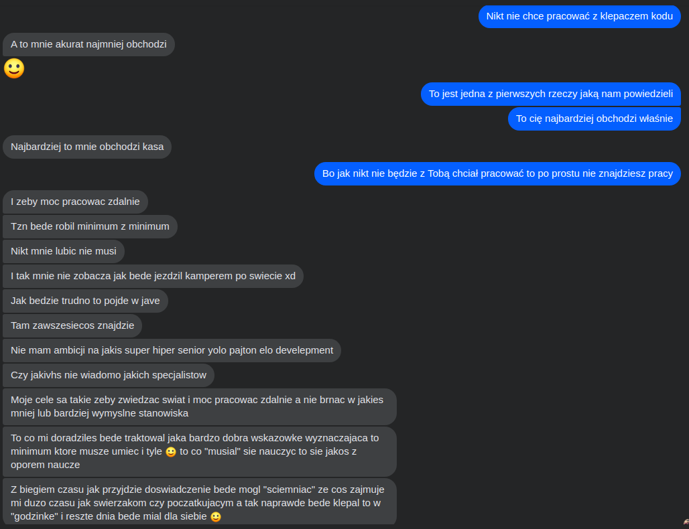

--- 
path: "/new_beginning"
date: "2021-05-17"
title: "Od konstruktora do programisty"
author: "mfordas"
tags: ["coding", "webdev", "javascript"]
short: "Jak wyglądał mój proces przebranżowienia z zawodu konstruktora na programistę JavaScript."
pic: "mf.jpg"
---

  

    <h4>Dlaczego zdecydowałem się na przebranżowienie?</h4>
        
Na początek może krótko o tym co robiłem przed zmianą pracy. Zajmowałem się projektowaniem części z tworzyw sztucznych, a konkretniej modułów zderzaków samochodowych. Wykonywałem modele 3D poszczególnych części oraz byłem  team leaderem. W ciągu 6 lat pracy jako konstruktor brałem udział w projektowaniu zderzaków do takich samochodów jak: Porsche 911, Mercedes S-klasa, Mercedes S-klasa AMG, Mercedes C-klasa coupe, Mercedes GLA i jeszcze kilku innych.

        
Teraz pewnie w głowie niektórych z Was rodzi się pytanie dlaczego chciałem zmienić pracę skoro, wielu mogłoby marzyć o takim stanowisku. Podczas drugiego dnia pracy w STX zadała mi to pytanie Kasia, z którą dołączyliśmy do firmy tego samego dnia. Powodów było kilka - wymienię je tutaj, ale nie zwracajcie uwagi na kolejność, bo szczerze mówiąc, nie umiem powiedzieć, które były ważniejsze:

        <ul>
        <li>naprawdę lubię programować. Podczas nauki nabrałem pewności, że mógłbym to robić zawodowo.</li>
        <li>po rozmowach z kolegami programistami podobało mi się podejście do człowieka w branży IT.</li>
        <li>w poprzedniej firmie zostałem sam we wrocławskim dziale, ponieważ moi współpracownicy odeszli z firmy.</li>
        <li>branża IT jest obecnie jedną z najszybciej rozwijających się, więc daje dobre perspektywy zatrudnienia  na przyszłość, a przede mną jeszcze ponad 30 lat pracy!</li>
        <li>lubię się rozwijać i uczyć nowych rzeczy, a patrząc na to jak szybko w IT się wszystko zmienia, będę skazany na ciągłą naukę (dla niektóry pewnie jest to minus).</li>
        </ul>
        <h4>Nauka</h4>
        

        
        

        
Sam proces nauki trwa do teraz i na pewno będzie jeszcze trwał,, ale do rzeczy - jak to się zaczęło? Do rozpoczęcia nauki programowania miałem kilka podejść. Zaczynałem się uczyć, ale chwilę później  okazywało się, że rozpoczyna się nowy projekt i pracy było tyle, że nie miałem na nic czasu, dosłownie. Językiem, od którego zaczynałem była Java ze względu na to, że miałem podczas nauki wsparcie mojego kolegi Pawła, którego z tego miejsca pozdrawiam. Podejść do nauki było 2-3, ale zawsze kończyły się tak samo - brakiem czasu, a z tego powodu brakiem systematyczności.

        
Nadszedł rok 2019 i luźniejszy czas w pracy, zdecydowanie za luźny dla kogoś takiego jak ja, kto nie znosi próżni. Początkowo zajmowałem czas rozwojem wiedzy produktowej, chodziłem na meetup’y, na których poznałem sporo fajnych osób i dużo czytałem na temat zarządzania projektami.

        
Przyszedł wrzesień. Trafiłem na facebook’u na ogłoszenie o CodersCamp i pomyślałem, że będzie to bardzo dobra motywacja do nauki. Wysłałem zgłoszenie, zostałem zaproszony na test wstępny, który udało mi się zaliczyć i zacząłem naukę w 6-osobowym zespole. Kurs trwał 3 miesiące i polegał na zrealizowaniu 4 projektów pod okiem mentora. Jeśli jesteście ciekawi szczegółów to znajdziecie je w jednym z moich poprzednich <a href='https://fordas.pl/coderscampres' target='_blank'><b>postów</b></a> na blogu. Dlaczego CodersCamp? Ponieważ  był za darmo i motywował do nauki, tak po prostu. Nie widzę sensu wydawania XX tysięcy złotych na bootcampy, które trwają 3 miesiące, a i tak nie zostanie się po nich programistą.

        
Po kursie zaczął się czas samodzielnej nauki. Zaczęły się też projekty w pracy, więc czasu było mniej, ale jakby spojrzeć na mojego Github’a z 2020 roku to można powiedzieć, że uczyłem się w miarę systematycznie:

        

            
        

        
Czego się uczyłem? Podstawą było to, co przerabialiśmy na CodersCamp, czyli JavaScript, Node.js, React, MongoDB, ale zrobiłem również mały zwiad, jakie technologie  aktualnie pojawiają się w ogłoszeniach o pracę i powyższy zestaw rozszerzyłem o Reduxa, MySQL, React Native i Jest. Teraz niektórzy powiedzą, że lepiej ukierunkować się w jedną stronę - frontend lub backend, ale moim zdaniem fullstack nie był takim złym wyborem. Na jednej rozmowie usłyszałem, że w porównaniu do kogoś, kto nigdy nie robił backendu, mam chociaż podstawową wiedzę jak robi się API i jak to działa, więc jak zwykle - ile ludzi tyle opinii.

        
Jak tak sobie pomyślę, to średnio, w 2020 roku poświęcałem na naukę programowania około 2-3 godzin dziennie. Mówiąc naukę, nie mam na myśli tylko pisanie kodu, ale także czytanie książek i artykułów, uczestnictwo w meetup’ach online, czy oglądanie filmików na YT. Miałem taką sytuację, że znalazłem serię filmików o wzorcach projektowych (18 sztuk od 20 min do 1,5 godziny) i założyłem sobie, że od tego momentu codziennie oglądam jeden. W jedną sobotę wypadł mi całodniowy wyjazd, a akurat filmik zaplanowany na ten dzień trwał 1,5h, więc wstałem o 6:30, żeby zdążyć go obejrzeć.

        
Oczywiście były dni w które powiedziałem sobie: “nie no, bez przesady, wezmę piwko i obejrzę jakiś serial”, ale też były dni, kiedy nie odrywałem się od komputera od rana do wieczora za wyjątkiem przerwy na obiad. Nie mogę powiedzieć, że nauka zawsze była przyjemna. Bywało, że po 8-12 godzinach pracy byłem już mocno zmęczony i po prostu mi się nie chciało. Były dni, że po skończeniu pracy patrzyłem w lustro i widziałem, popękane żyłki w oczach od długiego siedzenia przed komputerem. Były dni, że usiadłem z zamiarem zrobienia czegoś i po kilku godzinach prób okazywało się, że mi się nie udało, ale przychodził następny dzień i znowu zaczynałem się uczyć. Jeśli ten wpis czytają osoby, które też chcą zmienić pracę to chcę Wam powiedzieć, byście nie przejmowali się tym, że coś Wam nie wychodzi, że Wam się nie chce, że coś Wam długo zajmuje. Wszyscy jesteśmy tylko ludźmi, każdy kiedyś zaczynał.

        
Jak zacząć naukę? Niekoniecznie trzeba od razu zapisywać się na coś w stylu CodersCamp. W zamian można po prostu wykupić na Udemy kurs i go konsekwentnie realizować. Koszt takiego kursu jest stosunkowo niski (40-70 zł) a otrzymujemy uporządkowaną wiedzę, co w początkowym okresie nauki jest bardzo dużym ułatwieniem.

        
Najważniejsze jest to, aby się nie zniechęcać. To Wam się również przyda podczas poszukiwania pracy, bo w tym procesie pojawi się jeszcze więcej zniechęcających rzeczy niż podczas nauki.

        
Jedna ważna uwaga - jeżeli chcesz zmienić pracę dlatego, że w IT są złote góry i jedyne, czego chcesz to hajs oraz masz podejście jak gość ze screena poniżej to po prostu sobie odpuść, bo nikt nie będzie chciał z Tobą pracować i raczej nikt Cię nie zatrudni, a nawet jeśli, to szybko skoryguje swój błąd.

        

        
        

        <h4>Poszukiwania pracy</h4>
        
Jak już uznacie, że nadchodzi czas na szukanie pierwszej pracy to możecie się mocno zdziwić. No bo jak to, przecież wszyscy wkoło mówią, że brakuje XX tysięcy programistów, a Wy wysyłacie CV i nic, zero. No to jak to jest?

        
Ano brakuje programistów, ale doświadczonych. Myślę, że w 2020 roku wysłałem ponad 80 CV. Był to trochę niefortunny rok na poszukiwanie nowej pracy, bo dużo firm zatrzymało czasowo rekrutacje, ale trochę pokazuje skalę z jaką trzeba się zmierzyć. Z tych 80 CV dostałem odpowiedź może na jakieś 15. Nie wliczam do tej puli automatycznych odpowiedzi z systemu. Chcę tutaj zaznaczyć, że ten akapit nie ma na celu krytyki kogokolwiek. Jak ktoś po przeczytaniu tego tekstu skojarzy go ze sobą i poczuje się urażony to widocznie bierze to co tutaj napiszę za bardzo do siebie.

        
Zacznę od tego, że w moim przypadku poszukiwanie pracy to sinusoida. W jednej chwili wielka radość, w drugiej wielki smutek. Najgorszym etapem dla mnie było przejście selekcji CV, bo ani nie miałem żadnego doświadczenia komercyjnego, nie byłem po studiach informatycznych, ani nie byłem studentem. Później jak już trafiałem na rozmowę/ rozwiązywałem zadanie rekrutacyjne to dostawałem przeważnie dobrą odpowiedź zwrotną, ale nie zawsze ;) Nie wiem na ile to było szczere, a na ile ktoś nie chciał mnie zniechęcać. Opiszę Wam kilka sytuacji, które bardzo mnie podbudowały i przyniosły wartość dodaną podczas szukania pracy:

        <ol>
            <li>Marzec 2020 - wysłałem swoje CV do firmy Brainhub na ogłoszenie Fullstack JavaScript Developera. Wiedziałem, że mój profil nie do końca pasuje do ich wymagań, ale postanowiłem spróbować. Zajmująca się rekrutacją Agnieszka Branach dała mi szansę i podesłała zadanie rekrutacyjne, z którego dostałem bardzo pozytywny feedback i przeszedłem do następnego etapu, którym była rozmowa techniczna. Niestety nie zostałem zatrudniony, ale dostałem rzeczowy feedback i słowa motywujące do dalszej nauki.</li>
            <li>W okolicach maja na Wykopie zobaczyłem wpis, że ktoś szuka frontend’owca z Reactem i wysłałem swoje CV. Czekałem kilka dni na odpowiedź, ale mimo tego, że nie zaprosili mnie na rozmowę to dostałem taką odpowiedź:
            “... Gdybym prowadził taką rekrutację jak w grudniu ubiegłego roku, gdzie szukałem kogoś początkującego Twoje CV przebiłoby wszystkie, które wtedy do mnie spłynęły.”. Mega mnie to ucieszyło i zmotywowało.</li>
            <li>Kolejna sytuacja miała miejsce w październiku, kiedy to po rozmowie technicznej dostałem zaproszenie do współpracy. Byłem wtedy mocno zaskoczony decyzją o zatrudnieniu mnie i ostatecznie nie zdecydowałem się przyjąć oferty. Powiedziałbym, że po prostu się przestraszyłem. Wiedziałem już wtedy o bardzo dużych zmianach, które czekają mnie w życiu i po prostu stchórzyłem ;)</li>
            <li>Grudzień przyniósł kolejną ofertę pracy, od mojej obecnej firmy - STX Next. Obiektywnie mogę powiedzieć, że była to jedna z lepszych rekrutacji w jakich brałem udział i co najważniejsze - dotrzymanie słowa odnośnie informacji zwrotnej po rozmowie technicznej i HR’owej.</li>
        </ol>
        
Podsumowując te super sytuacje to życzę wszystkim firmom podejścia do rekrutacji takiego jak mają STX Next i Brainhub. Te dwie rozmowy miały dla mnie największą wartość, zarówno pod względem samego doświadczenia z rekrutacją (w której tak naprawdę ostatni raz brałem na ostatnim roku studiów czyli… łohoho z 7 lat temu), jak i informacji zwrotnej na temat posiadanej wiedzy.

        
Teraz chciałbym przejść do opisania sytuacji, które były mega słabe, niekoniecznie z winy firmy rekrutującej. Nikt się nie musi bać, że tutaj będę operował nazwami firm, ale jeśli akurat ktoś, kto był bohaterem jednej z tych sytuacji będzie to czytał to niech uzna to za feedback, którego do tej pory wam nie dałem.

        <ol>
            <li>Wysłałem CV na ogłoszenie na stanowisko Front End Developera z bardzo dużym doświadczeniem. Pewnie powiecie, że mogłem tego nie robić, bo zawracam komuś niepotrzebnie głowę, ale słuchajcie co się stało. Na następny dzień dzwoni do mnie pani rekruterka i mówi, że “nigdy jeszcze nie widziała takiego ładnego CV i fajnego portfolio”. Dodatkowo podczas rozmowy mówi, że widzi na moim GitHub’ie, że mam tam dość dużo aktywności. Na koniec pyta czy możemy pogadać po angielsku, nie ma problemu. Informuje mnie, że do końca tygodnia się odezwie z informacją zwrotną. Po rozmowie idę do żony, opowiadam o co chodziło, mega początek tygodnia. Cud, miód, orzeszki - no prawie, bo do teraz się nie odezwała. ;)</li>
            <li>Druga sytuacja trochę podobna. Dostaję info, że teraz akurat pani idzie na urlop i czy możemy się zdzwonić jak wróci. Spoko nie śpieszy się, więc odpowiadam, że jasne i czekam na kontakt. No i już minęło pół roku, albo i więcej.</li>
        </ol>
        
Wiadomo, że każdemu może zdarzyć się zapomnieć, ale wiedząc jaka jest obecnie sytuacja juniorów poszukujących pracy w branży IT byłoby miło jednak się odezwać, jeśli się to zadeklarowało.

        
W tej części chciałem Wam przekazać głównie to, że musicie próbować, bo nigdy nie wiadomo kto się odezwie. Może akurat jakaś firma mimo tego, że nie ma wystawionego ogłoszenia, to szuka kogoś do pracy. Oczywiście w tym wszystkim ważna też jest trzeźwa ocena swoich umiejętności - nie ma sensu wysyłać CV po trzech miesiącach nauki, bo to jest wtedy faktycznie zawracanie głowy. Chyba, że jesteście geniuszami. :)

        
Praktyczne rady, z których korzystałem podczas szukania pracy:

        <ul>
        <li>nie szukaj firm jedynie w Google, ale użyj do tego też Google Maps - może brzmi to jak szaleństwo, ale mało komu chce się przeglądać 30 stron z linkami, a na mapie też możesz znaleźć różne firmy,</li>
        <li>skompletuj sobie listę zakładek z interesującymi Cię firmami i sprawdzaj co jakiś czas czy nie pojawiło się tam nowe ogłoszenie, nie wszystkie otwarte rekrutacje pojawiają się na portalach z ogłoszeniami,</li>
        <li>stwórz sobie folder / dokument, w którym będziesz zapisywać do jakiej firmy w danym dniu wysłałaś/eś CV. Ja korzystałem z folderu, w którym tworzyłem podfoldery z nazwą firmy i datą, do których wrzucałem wysłane CV. Mogłem wtedy sprawdzić kiedy ostatni raz wysyłałem CV i jego wygląd,</li>
        <li>załóż konto na LinkedIn i dobrze uzupełnij swój profil. Warto zaprosić do swojej sieci rekruterów, szczególnie z firm, które wydają Ci się interesujące. Będziesz mieć wtedy dostęp do postów z aktualnymi ofertami pracy, które warto śledzić. Możesz także na swoim profilu dodać post informujący o tym, że szukasz pierwszej pracy oraz wysłać bezpośrednią wiadomość do wybranych rekruterów. Jest szansa, że po takim kontakcie dostaniesz wiadomość zwrotną, jeśli w ich firmie pojawia się rekrutacja juniorska,</li>
        <li>oprócz dobrze napisanego CV warto do aplikacji dołączyć link do swojego GitHuba. Myślę, że nie trzeba dodawać, że konto na GitHubie powinno zawierać przynajmniej kilka Twoich projektów (może niekoniecznie wszystkie, ale te najlepsze).</li>
        </ul>
        
Co do samych rozmów rekrutacyjnych:

        <ul>
            <li>nie stresuj się! Wiadomo, że łatwo powiedzieć, ale naprawdę wszystkim zależy, żeby poszło Ci jak najlepiej. Jeśli trafisz na jakąś nieprzyjemną rozmowę to możesz się tylko cieszyć, że wyszło to już na początku i nie będziesz musiał tego znosić codziennie w pracy.</li>
            <li>podczas rozmów technicznych, jeśli czegoś nie wiesz to po prostu powiedz, że tego nie wiesz. Lepsze to niż kręcenie i robienie z siebie głupka. Każdy normalny rekrutujący zrozumie braki wiedzy, ale kłamanie żaden. ;) Przyznać się do tego, że czegoś nie wiesz to też sztuka.</li>
            <li>Jeśli wydaje Ci się, że wiesz wszystko najlepiej to masz rację - wydaje Ci się.</li>
            <li>Traktuj wszystkich z szacunkiem - starasz się o pracę na stanowisko programisty, a masz jakąś rozmowę HR-ową?! Ale jak to, po co to komu? Softskille są moim zdaniem ważne i po prostu lepiej pracuje się z kimś kontaktowym niż wszystko wiedzącym bucem, któremu nic nie przetłumaczysz.</li>
        </ul>
        <h4>Pierwsze miesiące w nowej pracy</h4>
        

        
        

        
Tak jak już wspomniałem w poprzedniej części - trafiłem do STX Next jako Junior JavaScript Developer. Jakie były pierwsze miesiące? Jak wyglądał proces onboardingu? Myślę, że tym razem będzie krócej niż w przypadku poszukiwania pracy, ale zobaczymy jak to wyjdzie :)

        
Dokładnie czwartego stycznia dołączyłem do wrocławskiego oddziału STX Next. Pierwszy dzień polegał na przedstawieniu firmy, spotkaniach z osobami reprezentującymi różne działy i na wzajemnym poznaniu. Były rozmowy ogólnofirmowe, ale też lokalne. Mimo, że STX to już stosunkowo duża firma - niedawno przekroczyliśmy liczbę 400 osób na pokładzie - to każda z dołączających osób miała szansę zadać pytanie CEO <a href='https://www.linkedin.com/in/maciejdziergwa/' target='_blank'><b>Maciejowi</b></a> i SDD <a href='https://www.linkedin.com/in/micha%C5%82-kwiatkowski-41800167/' target='_blank'><b>Michałowi</b></a>.

        
Następne dni w przypadku juniorów to rozpoczęcie kursu wprowadzającego. Polega on na pracy nad wewnętrznym projektem podczas, realizacji którego nowi pracownicy:

        <ul>
        <li>zapoznają się ze Scrumem i pracą w zespole scrumowym,</li>
        <li>przygotowywani są do zbierania wymagań od klienta i prezentacji wyników pracy na sprint review,</li>
        <li>uczą się dobrych praktyk pisania kodu,</li>
        <li>poznają zasady pracy z systemem kontroli wersji,</li>
        <li>mają szansę poznać narzędzia z grupy DevOps wspomagające programowanie i wydawanie produktu,</li>
        <li>poznają się wzajemnie. :)</li>
        </ul>
        
Kurs trwał miesiąc i dla kogoś takiego jak ja był bardzo dobrym startem w branżę IT. Mniej więcej mogłem zorientować się co się z czym je i czego mogę się spodziewać w pracy w prawdziwym projekcie. Przez kurs przeprowadzili nas dwaj eksperci w swoich dziedzinach - Marek - Software Architect/Tech Lead i Krzysiek - Scrum Master. Po zakończeniu projektu wstępnego każdy został przypisany do projektu komercyjnego, w którym może zdobywać swoje pierwsze doświadczenie w pracy jako programista.

        
Podczas pierwszych trzech miesięcy każdy z nowych pracowników ma trzy rozmowy służące wymianie informacji zwrotnej:

        <ul>
        <li>pierwsza po około dwóch tygodniach, zbierająca pierwsze wrażenie obu stron, wymianę oczekiwań oraz  bliższe zapoznanie się z managerem,</li>
        <li>druga po około 1 miesiącu dotycząca atmosfery w firmie, zespole, wrażeń na temat kursu,</li>
        <li>trzecia po około 3 miesiącach uwzględniająca opinię kolegów z zespołu i klienta.</li>
        </ul>
        
Na chwilę obecną STX to idealne miejsce do rozwoju. Wszystkie osoby, które poznałem do tej pory były bardzo pomocne i otwarte. Mogę Wam tylko życzyć, żeby Wasza pierwsza praca jako programista również miała miejsce w STX Next, albo w firmie z zespołem podobnym do tego z STX’a.

