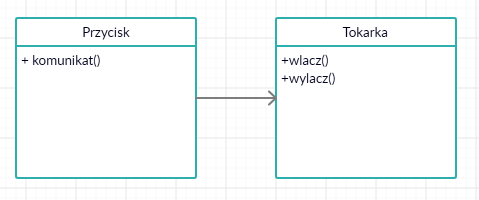
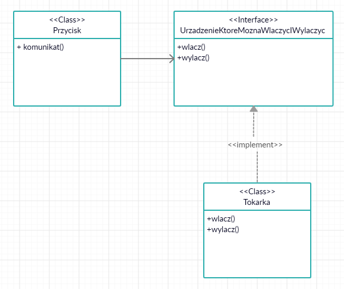

--- 
path: "/dobre-praktyki-solid"
date: "2020-11-02"
title: "Dobre praktyki. S.O.L.I.D. "
author: "mfordas"
tags: ["programming", "moimislowami"]
short: "Kilka słów o SOLID czyli zasadach projektowania obiektowego"
pic: "pexels-pixabay-257617.jpg"
---


<div>
                            <p>Gdy zaczynałem naukę programowania usłyszałem od kolegi programisty, że trzeba napisać bardzo dużo złego kodu żeby się czegoś nauczyć. Staram się więc w miarę możliwości napisać co najmniej kilka linijek kodu. Jednak jakiś czas temu kupiłem książkę "Czysty kod" R.C. Martina a następnie "Zwinne wytwarzanie oprogramowania" tego samego autora i oprócz kodowania, czytam i staram się wdrażać pisanie <b>dobrego i czystego kodu</b>. Cykl "Dobre praktyki" zacznę od SOLID.</p>
                                <p>
                            <p>Co to tak właściwie jest ten <b>SOLID</b> o którym wszyscy mówią? Jest to skrót od angielskich nazw pięciu zasad projektowania obiektowego:</p>
                                    <ol>
                                        <li>Zasada pojedynczej odpowiedzialności (<b>S</b>ingle Responsibility Principle - SRP)</li>
                                        <li>Zasada otwarte - zamknięte (<b>O</b>pen-Closed Principle - OCP)</li>
                                        <li>Zasada podstawiania Liskov (<b>L</b>iskov Substitution Principle - LSP)</li>
                                        <li>Zasada segregacji interfejsu (<b>I</b>nterface Segregation Principle - ISP)</li>
                                        <li>Zasada odwracania zależności (<b>D</b>ependency Inversion Principle - DIP)</li>
                                    </ol>
                                </p>
                                <p>W dalszej części wpisu postaram się opisać #moimislowami każdą zasad w prosty sposób żeby każdy mógł ją zrozumieć.</p>
                                <h3>1. Zasada pojedynczej odpowiedzialności (Single Responsibility Principle - SRP)</h3>
                                <p><b>Powód modyfikacji klasy powinien być tylko jeden.</b>[1]</p>
                                <p>Przykładowo mamy klasę Shape przedstawioną poniżej:
                                </p>
</div>

```javascript
   class Shape {

    constructor () {
        };

    calculateArea() {
        //implementation of method
        };

    drawShape() {
        //implementation of method
        };
};
```

<div>
<p>
Posiada ona dwie metody:
<ul>
<li>calculateArea - do obliczania pola powierzchni</li>
<li>drawShape - do rysowania kształtu</li>
</ul>
Jak widać jest ona odpowiedzialna za dwie rzeczy: obliczanie pola powierzchni i rysowanie kształtu. Więc mamy dwa powody do zmiany klasy. Aby trzymać się zasady pojedynczej odpowiedzialności możemy rozbić tę klasę na dwie osobne klasy:
</p>
</div>

```javascript
class GeometryOfShape {

    constructor () {
        };

    calculateArea() {
        //implementation of method
        };
};

class DrawRectangle {

    drawRectangle() {
        //implementation of method
        };
};
```
<div>
<h3>2. Zasada otwarte - zamknięte (Open-Closed Principle - OCP)</h3>
                                <p><b>Kod który piszemy (klasy, moduły, funkcje) powinien być otwarty na rozbudowę ale zamknięty na modyfikacje.</b>[1]</p>
                                <p>Ogólnie mówiąc chodzi o to, że jeśli mamy moduł wykonujący pewne zadanie a wraz z rozwojem aplikacji zmienią się wymagania klienta to możemy bez zmieniania kodu tego modułu (zamknięty na modyfikacje) dodać do niego zachowanie (otwarty na rozszerzenia), które sprosta nowym wymaganiom klienta. 
                                </p>
                                <p>Kluczem do uzyskania takiego stanu rzeczy są klasy abstrakcyjne i interfejsy.
                                </p>
                                <p>Teraz myślę, że powinien pojawić się jakiś dobry przykład z kodem. Podczas pisania tego wpisu przejrzałem kilka stron opisujących SOLID i moim zdaniem lepiej przeczytać rozdział "9 - OCP - Zasada otwarte-zamknięte" z książki Uncle Boba "Zwinne wytwarzanie oprogramowania". Tak się składa, że wujek Bob udostępnia wszystkie artykuły związane z SOLID całkowicie za darmo na <a
                                        href="http://butunclebob.com/ArticleS.UncleBob.PrinciplesOfOod"
                                        target="_blank"><b>tej </b></a>stronie. <a
                                        href="https://drive.google.com/file/d/0BwhCYaYDn8EgN2M5MTkwM2EtNWFkZC00ZTI3LWFjZTUtNTFhZGZiYmUzODc1/view"
                                        target="_blank"><b>Tutaj </b></a>macie bezpośredni link do artykułu o OCP. 
                                </p>
<h3>3. Zasada podstawiania Liskov (Liskov Substitution Principle - LSP)</h3>
                                <p><b>Musi być możliwość podstawienia typów pochodnych za ich typy bazowe.</b>[1]</p>
                                <p>Wyobraźmy sobie sytuację, że mamy klasę obstrakcyjną Food, która odpowiada za tworzenie jedzenia w grze Snake. Na podstawie, tej klasy możemy utworzyć różne rodzaje jedzenia stosując dziedziczenie: NormalFood, SuperFood, ComboFood.
                                </p>
                                <p>Jeśli mamy funkcję DrawFood ,która odpowiada za dodawanie tego jedzenia na planszy a jako argument przyjmuje Food to musi ona działać z klasą Food oraz wszystkimi jej pochodnymi. Jeżeli funkcja DrawFood nie działa z pochodnymi klasy Food to występuje naruszenie zasady LSP.
                                </p>
                                <p>Dogłębną analizę LSP wraz z różnymi przykładami możecie przeczytać <a
                                        href="https://drive.google.com/file/d/0BwhCYaYDn8EgNzAzZjA5ZmItNjU3NS00MzQ5LTkwYjMtMDJhNDU5ZTM0MTlh/view"
                                        target="_blank"><b>tutaj</b></a>.
                                </p>
<h3>4. Zasada segregacji interfejsu (Interface Segregation Principle - ISP)</h3>
                                <p><b>Klienty nie powinny być zmuszone do zależności od metod, których nie używają.</b>[1]</p>
                                <p>Krótko mówiąc, lepsze jest 5 małych interfejsów z kilkoma metodami niż jeden interfejs z wieloma. Powody są proste:</p>
                                    <ol>
                                        <li>Klasy implementujące interfejs nie będą zmuszone do implementacji metod, których nie potrzebują</li>
                                        <li>Jeśli jakaś klasa kliencka będzie wymagała od interfejsu zmiany to wpłynie to na mniejszą część pozostałych klas klienckich (albo w ogóle nie wpłynie na inne klasy klienckie jeżeli żadna z nich nie implementuje tego interfejsu).</li>
                                    </ol>
                                <p>Więcej oczywiście <a
                                        href="https://drive.google.com/file/d/0BwhCYaYDn8EgOTViYjJhYzMtMzYxMC00MzFjLWJjMzYtOGJiMDc5N2JkYmJi/view"
                                        target="_blank"><b>tutaj</b></a>.
                                </p>
<h3>5. Zasada odwracania zależności (Dependency Inversion Principle - DIP)</h3>
                                <p><b>Moduły wysokopoziomowe nie powinny zależeć od modułów niskopoziomowych. I jedne, i drugie powinny zależeć od abstrakcji.</b>[1]</p>
                                <p><b>Abstrakcje nie powinny zależeć od szczegółów. To szczegóły powinny zależeć od abstrakcji.[1]</b></p>
                                <p>Najlepiej wytłumaczyć to na przykładzie. Wyobraźmy sobie, że mamy dwa obiekty, które przekazują między sobą dane. Obiekt Przycisk, który pobiera informacje z zewnątrz (od użytkownika) sprawdza w jakim znajduje się stanie a następnie przekazuje do obiektu Tokarka komunikat Włącz lub Wyłącz. Tokarka następnie wysyła informację do fizycznego urządzenia jakim jest tokarka. Poniżej znajduje się diagram takiego rozwiązania.</p>
                                
                                <p>Problemem jest to, że klasa Przycisk bezpośrednio zależy od klasy Tokarka. Nie ma między nimi żadnej warstwy abstrakcji. Wysokopoziomowa strategia zależy od modułów niskopoziomowych a abstrakcje zależą od szczegołów.</p>
                                <p>Aby odwrócić zależność możemy posłużyć się interfejsem.</p>
                                
                                <p>Na drugim diagramie widać, że pomiędzy Przyciskiem a Tokarką umieściliśmy interfejs UrządzenieKtoreMoznaWlaczycIWylaczyc. Interfejs ten dostarcza abstrakcyjne metody Wlacz i Wylacz, których może użyć klasa Przycisk. Klasa Tokarka implementuje interfejs UrządzenieKtoreMoznaWlaczycIWylaczyc. Nie ma znaczenia co służy do włączania i wyłączania a także co jest włączane i wyłączane. Najważniejsze żeby obiekt, którym sterujemy wiedział jak używać interfejsu UrządzenieKtoreMoznaWlaczycIWylaczyc a obiekt sterowany implementował jego metody</p>
                                <p>Oczywiście <a
                                        href="https://drive.google.com/file/d/0BwhCYaYDn8EgOTViYjJhYzMtMzYxMC00MzFjLWJjMzYtOGJiMDc5N2JkYmJi/view"
                                        target="_blank"><b>tutaj</b></a> link do artykułu napisanego przez wujka Boba.
                                </p>
                                <h3>Podsumowanie</h3>
                                <p>Na pewno to co napisałem w tym poście na temat zasad SOLID nie jest wystarczające aby wyczerpać temat. Jest to jedynie zasygnalizowanie tematów, o których czytałem w książce "Zwinne wytwarzanie oprogramowania". Definicje, które umieściłem na początku każdego z akapitów pochodzą właśnie z tej książki. Wpis ma na celu streszczenie tych kilku rozdziałów na temat SOLID ale na pewno jej nie zastąpi. Oprócz wyżej wymienionej książki polecam również "Czysty Kod" R.C. Martina aby zapoznać się z innymi dobrymi praktykami.</p>
                                <p>Teraz pora na kolejny wpis jak odnieść powyższe zasady do JavaScript'u. Dzięki za czytanie i zachęcam do kontaktu.</p>
                                <p>
                                     Przydatne źródła:
                                    <ul>
                                        <li>"Zwinne wytwarzanie oprogramowania" - Robert C. Martin</li>
                                        <li>"Czysty kod" - Robert C. Martin</li>
                                        <li><a
                                        href="http://butunclebob.com/ArticleS.UncleBob.PrinciplesOfOod"
                                        target="_blank"><b>PrinciplesOfOOD - R.C. Martin (Uncle Bob)</b></a></li>
                                    </ul>
                                </p>
                            </div>