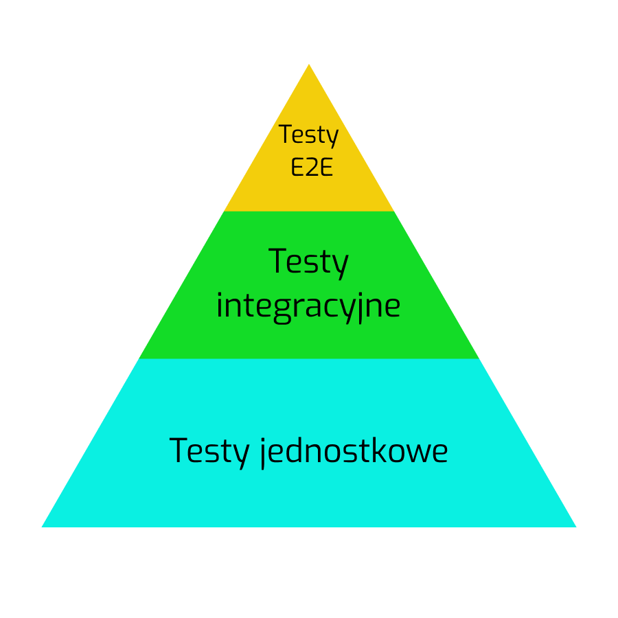

--- 
path: "/testinginjs"
date: "2020-09-27"
title: "Testowanie. Rodzaje testów automatycznych."
author: "mfordas"
tags: ["javascript", "testing", "moimislowami"]
short: "Czyli #moimisłowami o tym po co nam testy, rodzajach testów, frameworkach do testowania w JS."
pic: "pexels-catherine-sheila-4554744.jpg"
---

  

                           
Zacznę od tego, że nie będę tutaj zgrywał jakiegoś autorytetu w zagadnieniach poruszanych w serii #moimisłowami ponieważ ciągle jestem na etapie nauki programowania. Teksty, które będę tutaj umieszczał mają na celu odpowiedzenie w zwięzły sposób na kilka pytań związanych z tematem i skompletowanie źródeł, z których można dowiedzieć się więcej.
                                

                                

                                    Wymyśliłem kilka zagadnień związanych z testowaniem, o których chciałbym napisać #moimisłowami:
                                    <ol>
                                        <li>Po co nam testy?</li>
                                        <li>Podział testów</li>
                                        <li>Piramida testów</li>
                                        <li>Frameworki do testowania w JS</li>
                                    </ol>
                                

                                <h3>1.Po co nam testy?</h3>
                                
Programowanie w tym przypadku nie różni się wiele od innych dziedzin życia w których także przeprowadza się testy - są one potrzebne do wprowadzenia na rynek / do produkcji / do użytku jak najbardziej dopracowanego produktu, czyli takiego bez wad i w pełni funkcjonalnego. Testy pomogą nam również we wprowadzaniu zmian w produkcie bez obaw o jego prawidłowe funkcjonowanie - w przypadku programowania mówimy np. o refactoringu, czyli zmianie naszego kodu bez zmiany jego zachowania.

                                <h3>2.Podział testów</h3>
                                
Testy możemy podzielić na dwie główne grupy:
                                 <ul>
                                        <li>manualne</li>
                                        <li>automatyczne</li>
                                    </ul>
                                
Testy manualne to nic innego jak wielokrotne ręczne przeklikiwanie aplikacji w różnych scenariuszach i sprawdzanie jak nasz program się zachowuje.

                                
Testy automatyczne, po krótce można opisać jako pisanie dodatkowego kodu, który sprawdza nasz kod produkcyjny. Po napisaniu kodu testującego możemy w łatwy sposób go uruchomić i przekonać się czy nasz kod produkcyjny funkcjonuje w prawidłowy sposób. Testy automatyczne w przeciwieństwie do manualnych są szybkie i pozwalają w krótkim czasie sprawdzić wiele różnych przypadków. Pisanie testów automatycznych zabiera dodatkowy czas, ale dobrze napisane pozwalają na łatwiejszy rozwój i utrzymanie oprogramowania. Patrząc po ofertach pracy, każda szanująca się firma stawia na testowanie.

                                 

                                    Testy automatyczne możemy podzielić na 3 grupy:
                                    <ul>
                                        <li>jednostkowe</li>
                                        <li>integracyjne</li>
                                        <li>end to end</li>
                                    </ul>
                                

                                

                                
<b>Testy jednostkowe</b> służą do sprawdzania działania kodu bez interakcji zewnętrznych, czyli np. bez połączenia z bazą danych lub pobierania informacji z zewnętrznego API. Są najszybsze z testów automatycznych. Niestety przez to, że często aby przetestować kod bez połączenia z bazą danych musimy zasymulować to połączenie, nie dają nam one pewności czy wszystko na pewno działa tak jak należy.

                                
<b>Testy integracyjne</b> sprawdzają kod aplikacji w interakcji ze źródłami zewnętrznymi, czyli jeśli kod naszej aplikacji podczas normalnej pracy zapisuje coś w bazie danych to podczas testów integracyjnych również odbywa się zapisywanie do bazy danych (oczywiście do jakiejś testowej). Trwają dłużej niż testy jednostkowe ale pozwalają nam czuć się bezpieczniej pod względem jakości naszego kodu.

                                
Na koniec zostały <b>testy end to end</b>. Polegają one na zaprogramowaniu przejścia określonej ścieżki w naszym programie, przykładowo możemy sprawdzić ścieżkę: zalogowanie -> wykonanie jakiejś operacji -> wylogowanie. Są najwolniejsze z testów automatycznych ponieważ wymagają uruchomienia aplikacji i automatycznego przeklikania konkretnych scenariuszy. Dają największą pewność co do działania aplikacji ale są również najbardziej podatne na zmiany interfejsu użytkownika.

                               <h3>3. Piramida testów</h3>
                                
Piramida testów określa jaką ilość danego rodzaju testów powinniśmy pisać. Jak łatwo się domyślić najwięcej powinno być testów jednostkowych ponieważ są one najszybsze a co za tym idzie najtańsze. Następne w kolejności są testy integracyjne i e2e. Oczywiście piramida testów jest tylko ogólnym założeniem i w zależności od rodzaju aplikacji proporcje ilości testów mogą się różnić.
                                

                                

                                    

                               <h3>4. Frameworki do testowania w JS</h3>
                                
Dzięki frameworkom do testowania dostajemy gotowy zestaw funkcji, z których możemy skorzystać a także program, który uruchamia wszystkie napisane przez nas testy i sprawdza, które się powiodły, a które nie i wyświetla nam raport. 
                                

                                 

                                    Trzy najbardziej popularne frameworki do testowania w JS to:
                                    <ul>
                                        <li><a
                                        href="https://jestjs.io/"
                                        target="_blank"><b>Jest</b></a></li>
                                        <li><a
                                        href="https://jasmine.github.io/"
                                        target="_blank"><b>Jasmine</b></a></li>
                                        <li><a
                                        href="https://mochajs.org/"
                                        target="_blank"><b>Mocha</b></a></li>
                                    </ul>
                                

                                
Nie mogę się wypowiedzieć, który jest najlepszy bo się na tym nie znam ale mogę powiedzieć, że ja używam Jest. Wydaje się całkiem przyjemny chociaż do tej pory trafiłem już na kilka problemów, których rozwiązanie zajęło mi dużo czasu (m.in. z mockowaniem funkcji).

                                 

                                     Przydatne źródła:
                                    <ul>
                                        <li><a
                                        href="https://www.youtube.com/watch?v=7r4xVDI2vho"
                                        target="_blank"><b>Jest Crash Course - Traversy media</b></a></li>
                                        <li><a
                                        href="https://www.udemy.com/course/nodejs-master-class/"
                                        target="_blank"><b>Kurs Mosha na temat NodeJs a właściwie rozdziały 12, 13, 14</b></a></li>
                                        <li>Dokumentacja każdego z frameworków</li>
                                    </ul>
                                

                        
