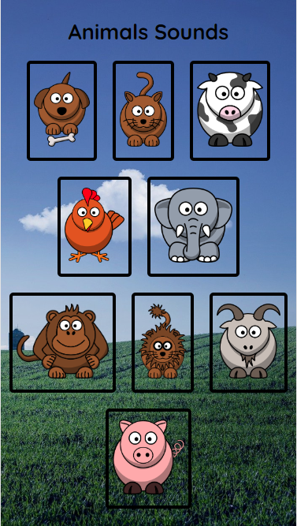
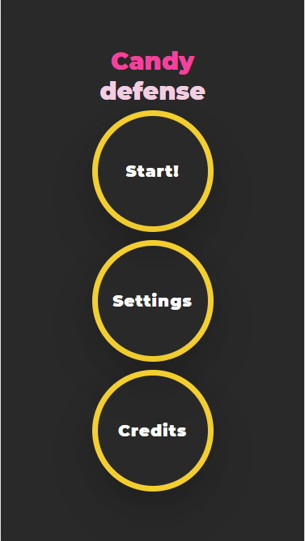
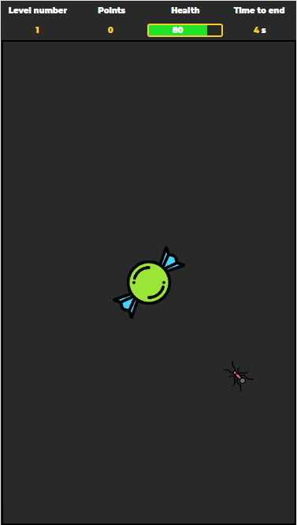
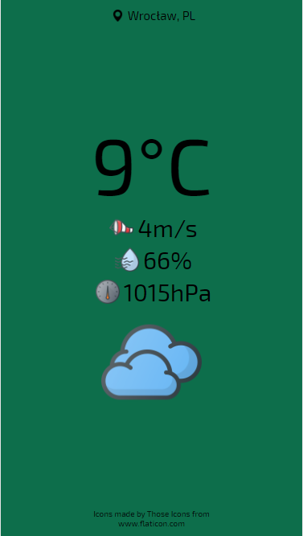

--- 
path: "/vanillajs"
date: "2020-02-18"
title: "VanillaJS - aplikacje bez bibliotek i frameworków"
author: "mfordas"
tags: ["coding"]
short: "Po zakończeniu CodersCamp przyszedł czas na rozwój i doskonalenie umiejętności zdobytych na kursie.
                                        Zacząłem od powtórki HTML, CSS i czystego JavaScript."
pic: "vanilla_js_all.png"
---

 

                                
Zaliczam się do osób, które uważają, że trzymiesięczny kurs programowania to tak na
                                    prawdę tylko początek nauki, więc od razu po zakończeniu zabrałem się za powtórzenie
                                    i rozszerzenie wiadomości z kursu. Na pierwszy ogień poszły <b>HTML</b>, <b>CSS</b> i czysty
                                    <b>JavaScript</b>. Chciałem również poćwiczyć konfigurację nowych projektów, które
                                    wykorzystują <b>npm</b>, <b>Webpack</b>'a i <b>Babel</b>. Dodatkowo napisałem testy wykorzystując <b>Jest</b>.
                                

                                
Pierwsza, prosta aplikacja to Animals Sounds. Odtwarza ona dźwięki zwierząt. W sumie
                                    nic specjalnego ale muszę przyznać, że gdy pokazywałem ją rodzinie i znajomym
                                    wywoływała uśmiech na twarzy. Polecam szczególnie grupie wiekowej 0-3 a także czującym, że
                                    zaliczają się do takiej grupy. Aplikację możecie zobaczyć pod tym linkiem <a
                                        href="https://fordas.pl/animals_sounds/Animals_sounds"
                                        target="_blank"><b>KLIK</b></a>.

                                

                                    

                                
 Druga aplikacja to gra Candy defense. Myślę, że każdy z nas widział jak wygląda
                                    upuszczony na ziemię cukierek chwilę po tym gdy tylko dowiedzą się o nim mrówki -
                                    stąd wziął się pomysł na grę. Bronimy w niej naszego upuszczonego cukierka przed
                                    chcącymi go zjeść mrówkami. Gra dostępna jest pod tym adresem <a
                                        href="https://fordas.pl/CandyDefense/Candy_defense"
                                        target="_blank"><b>KLIK</b></a>.

                                

                                    
                                    
                                

                                
 Trzecia aplikacja to Wthr. Minimalistyczna aplikacja pogodowa pozwalająca sprawdzić
                                    temperaturę, siłę wiatru, ciśnienie i wilgotność, wykorzystująca zewnętrzne API.
                                    Pogodę możecie sprawdzić tutaj <a href="https://fordas.pl/Wthr/Wthr"
                                        target="_blank"><b>KLIK</b></a>.
                                

                                

                                    
                                    

                                
Byłoby mi niezmiernie miło przeczytać Wasze opinie na temat aplikacji - te dobre i
                                    złe. Jeśli macie jakieś pomysły na dodatkowe rzeczy, które mogłyby znaleźć się w
                                    którejś z aplikacji to chętnie je przyjmę. Dzięki za czytanie i zachęcam do
                                    kontaktu.

                            

                           